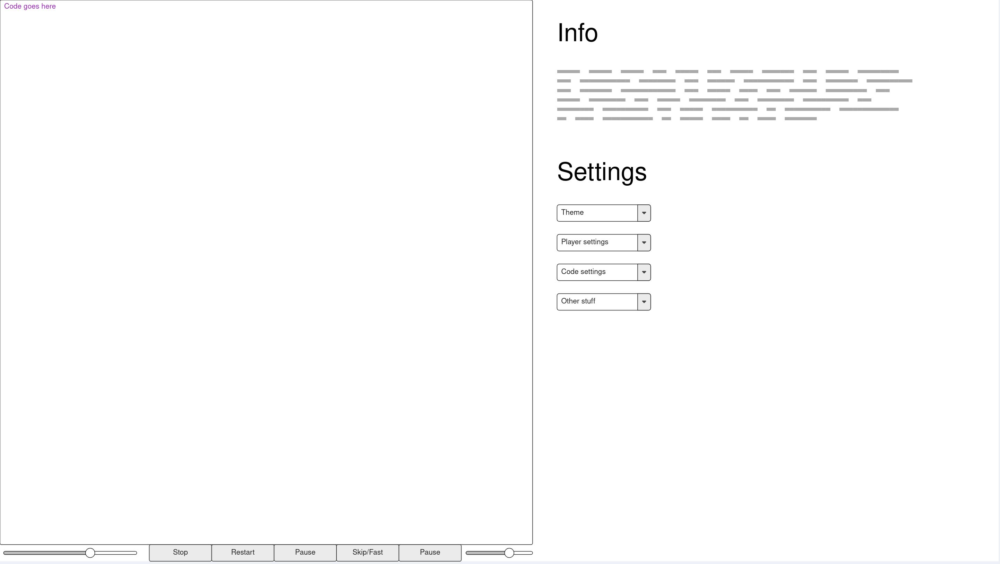
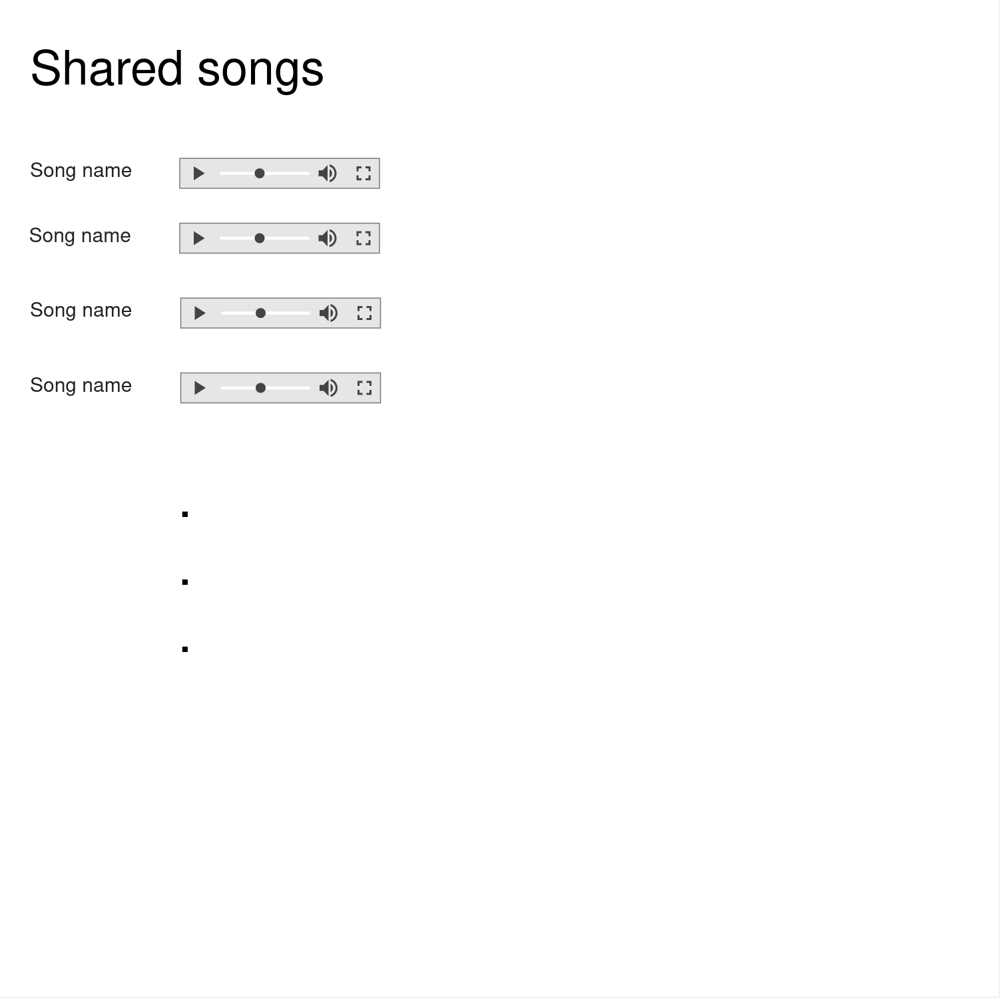
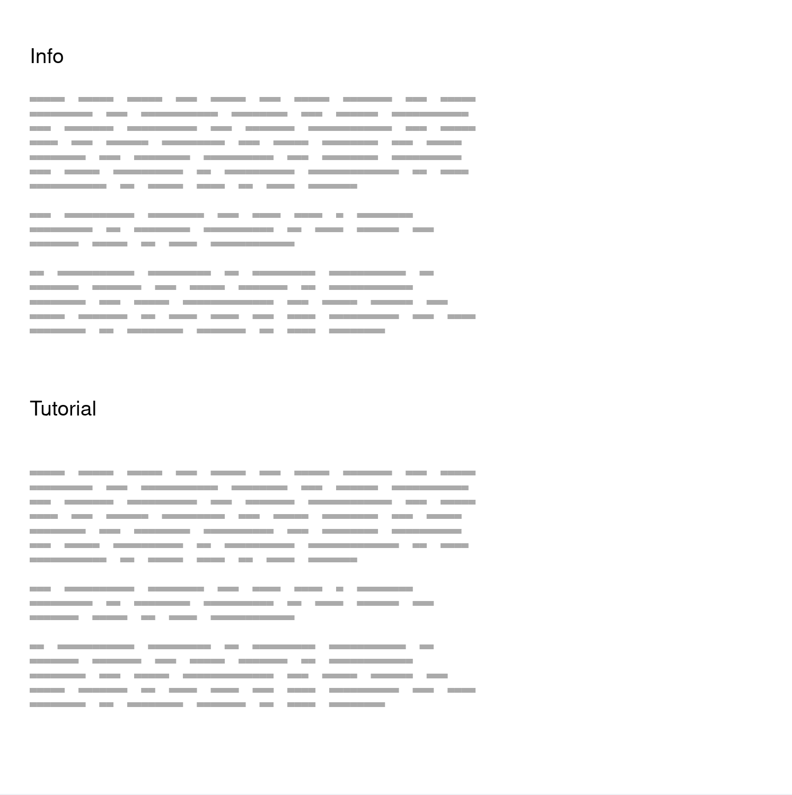

# bytebeat_sharing
a website to share cool bytebeats c:

## To run

1. Download project via download button or git clone
2. Open project folder in visual studio code
3. Make sure to have Microsoft's Live Preview extension installed
4. Using the visual studio code command palette, start the live preview server
5. Head to a browser and open localhost:3000/index.html, or use the window opened in vs code

## Project specification

My idea for this project is to make a website for the purpose of sharing bytebeat music. As a brief
description for those unaware: bytebeat music is a type of algorithmic and minimal music that is
generated through (typically) very small programs. The structure is usually a for loop that increments
a single variable (usually called `t`) and the program will print that value after some bitwise and/or
numerical manipulation, upon which it gets piped to something that turns that value to audio. This
type of music has evolved over time from it's basic form of a C program piping their output to alsa
in order to become more convenient to work with. Though the C program form still exists, another form
that is popular is through websites with a small text area that allows the user to enter code which
manipulates the given variable(s) and then generates an audio file for the user to listen to their creation.

My idea is to make a website similar to the ones described above, however I also want to include the
ability for users to share their creation. These files are typically very small, the idea is to save
a 30 second clip of the generated audio and allow that to be published. Users can then browse what
other users have created along with the code that generated the audio file that was submitted.
The main landing page will be a simple editor for the user to write their program, along with some
playback controls to listen to it as they work on it below the editor. Off to the side is a side panel
that allows the user to tune playback settings from many standard popular options. I also want to
include a separate about page that explains what bytebeats are as well as giving a brief tutorial
and explanation of how one can write their own.

The target audience here is just the general public, although it'll likely be those who already have
a predisposed interest in programming and the like. I do ideally hope to create something that makes
bytebeat more approachable for people to allow greater access to it.

The part where data upload and retrieval comes into play is for the purpose of upload and browsing
user creations. Uploading will upload the actual text of the program (as it is much smaller than the
audio, though the audio is small) and retrieval will work on a page system with a show X per page
drop down menu that allows the user to select how many items they want to view at a time. The website
will then retrieve the desired list of items and show it to the user. The retrieved data will be the
song's code, and name, as well as the name of the user who uploaded it.

I think my stretch goals would include creating a visaulizer that lets the user visualize the sound,
giving them the ability to speed up playback, and maybe play sound in reverse.

wireframe sketch:

Main page:

Browsing page:

About/tutorial page:

